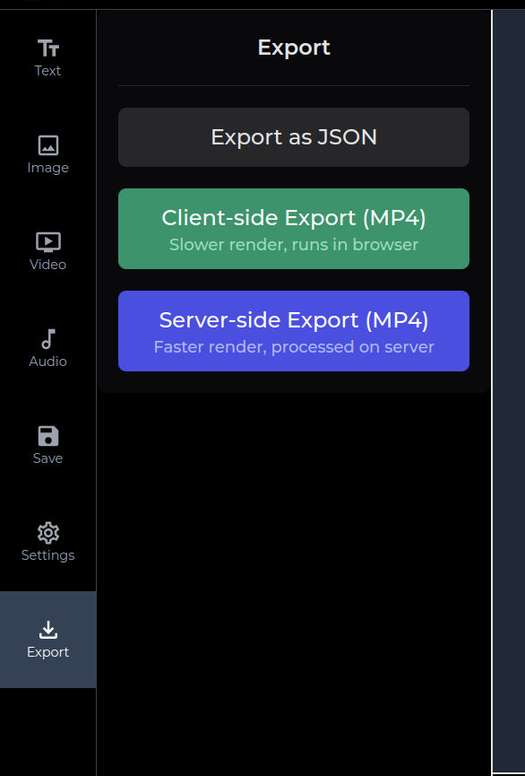

## How to Create and Edit a Video Using VideoAiditor

Follow these steps to upload assets, create a video, and use the API to manage and share video edits using VideoAiditor.

### Step 1: Edit a Video in the Editor

1. Go to [https://editor.videoaiditor.com](https://editor.videoaiditor.com).
2. Start by uploading your assets (e.g., images, videos, audio).
3. Edit your video using the available tools in the editor.

**Note:** These uploads are client-side only — no data is actually sent to the server.

### Step 2: Export the Video

Once you've created your video, go to the **Export** tab.



You have two options for exporting:

- **MP4:** Choose this option if you want to download the video as an MP4 file.
- **JSON:** If you want to use the video as a template for your AI platform, export the video as a JSON file.

## Replace Asset URLs in the JSON

If you've chosen to export as JSON, you will need to modify the file before sending it to the API:

- Open the exported JSON file.
- Replace the source URLs of the assets with valid, publicly accessible URLs (e.g., links to images or video files).
- Ensure that the URLs are publicly accessible; otherwise, the video may not load correctly.

## Step 3: Use the API to Create the Video

Send your edited video JSON and get the link for further editing, use the following API endpoint:

Add your API key to the request header as follows:

- `x-api-key: YOUR_API_KEY`

Send a `POST` request to `https://api.videoaiditor.com/v1/videos` with the JSON body and the appropriate headers.

### Request Body Example

```json
{
  "version": "<string>",
  "metadata": {
    "name": "<string>",
    "backgroundColor": "<string>",
    "duration": 123,
    "fps": 123,
    "canvas": {
      "width": 123,
      "height": 123
    }
  },
  "clips": [
    {
      "id": "<string>",
      "type": "<string>",
      "name": "<string>",
      "source": "<string>",
      "timeFrame": {
        "start": 123,
        "end": 123
      },
      "position": {
        "x": 123,
        "y": 123,
        "z": 123
      },
      "transform": {
        "scale": {
          "x": 123,
          "y": 123
        },
        "rotation": 123
      },
      "size": {
        "width": 123,
        "height": 123
      },
      "effects": {
        "opacity": 0.5
      },
      "textProperties": {
        "content": "<string>",
        "fontSize": 123,
        "fontWeight": 123,
        "fontFamily": "<string>",
        "color": "<string>",
        "backgroundColor": "<string>",
        "textAlign": "<string>",
        "fontStyle": "<string>",
        "lineHeight": 123,
        "underline": true
      }
    }
  ],
  "additional": {}
}
```

## Step 4: Handle the Response

Once you send the request, the API will return a response that includes data in the following format:

```json
{
  "data": {
    "metadata": {
      "redirectUrl": "https://videoaiditor.com/editor/{unique-id}",
        ...
    }
    ...
    ...
  }
}
```

### Important: Save the `redirectUrl`

The response will contain a `redirectUrl` field in the metadata. **Save this URL** — it's a special link that will allow you to continue editing the video.

- The URL is **public** but only accessible to users who have the link.
- You can share this URL with others to allow them to edit the video. Since it's a presigned URL, no one else will be able to access it without the exact link.

## Final Notes

- **Security:** Be cautious when sharing the `redirectUrl` since it provides direct access to that video in video editor.
- **Public Access:** Ensure the asset URLs you provide in the JSON are publicly accessible. If they are private or restricted, the video may not load correctly when editing.
- **API Key:** Keep your API key secure. Do not share it in public forums or expose it in client-side code.
